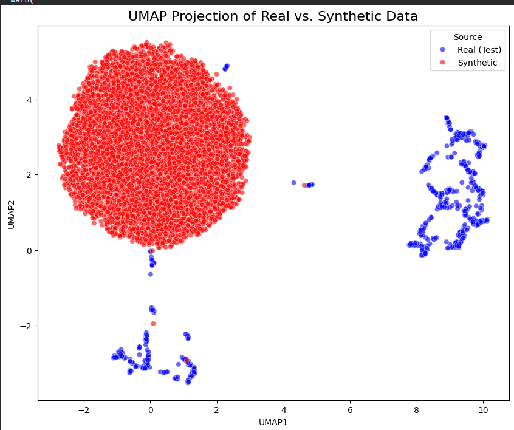
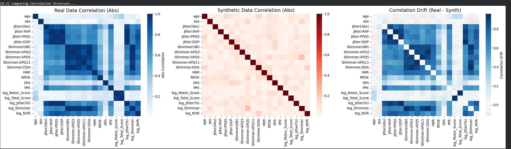
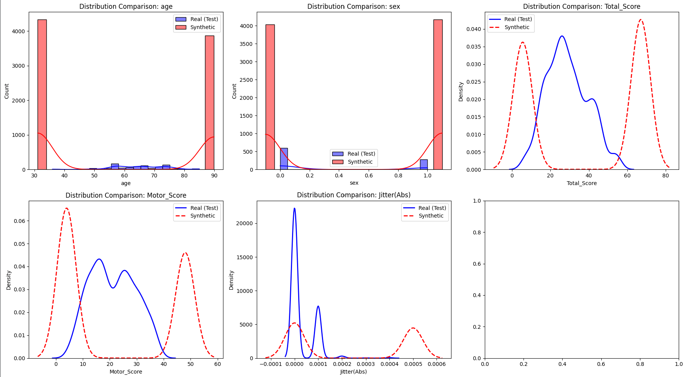

# Synthetic Medical Record Generation Engine (Syn-MRGE) for Parkinson's Disease

## Project Overview

This project implements a prototype **Synthetic Medical Record Generation Engine (Syn-MRGE)** for Parkinson's Disease patient records using Denoising Diffusion Probabilistic Model (DDPM) to create realistic, high-fidelity synthetic patient records.

| Detail               | Value                                                                              |
| :------------------- | :--------------------------------------------------------------------------------- |
| **Data Source**      | Publicly available Parkinson's Telemonitoring Dataset from Kaggle                  |
| **Generative Model** | **DDPM (Denoising Diffusion Probabilistic Model)**                                 |
| **Output**           | 20 features, including Motor/Total UPDRS Scores, Age, Jitter, and Shimmer Metrics. |
| **Architecture**     | Custom **PyTorch MLP** with Time Embeddings.                                       |

## 1. Data Ingestion & Preprocessing Pipeline

My first goal was to establish a reproducible and professional data source

| Tool/Method                             | Rationale & Outcome                                                                                                                                                                                                                   |
| :-------------------------------------- | :------------------------------------------------------------------------------------------------------------------------------------------------------------------------------------------------------------------------------------ |
| **KaggleHub API**                       | Used the Kaggle API for direct, programmatic data ingestion, avoiding manual downloads.                                                                                                                                               |
| **Data Cleaning**                       | Cleaned 5875 patient records, handling implicit data types and dropping redundant ID columns (`subject#`, `test_time`).                                                                                                               |
| **Feature Engineering (Log-Transform)** | Log-transformed highly-skewed features (`Total_Score`, `Jitter(%)`, `Shimmer`, etc.) using `np.log1p`. **This was a crucial step** to stabilize the data distribution and ensure the DDPM model could effectively learn the variance. |
| **Scaling**                             | Applied **MinMaxScaler** to all 20 final numerical features, normalizing the input vector to $\mathbf{[0, 1]}$, which is required for stable diffusion model training.                                                                |

## 2. Model Design and Architecture

### **DDPM as the Core Engine**

I chose **DDPM** as the generative modeling framework due to its inherent stability during training and its proven capability to generate high-quality, diverse samples.

### **The Denoising Architecture ($\epsilon_{\theta}$)**

| Component        | Design Choice                             | Rationale & Thought Process                                                                                                                                                                                                                               |
| :--------------- | :---------------------------------------- | :-------------------------------------------------------------------------------------------------------------------------------------------------------------------------------------------------------------------------------------------------------- |
| **Network Type** | **MLP (Multi-Layer Perceptron)**          | Since the input data is a low-dimensional vector ($\text{N}=20$ features) and not an image grid, an MLP is the **most efficient and mathematically appropriate** choice. Using a complex U-Net would be inefficient and prone to overfitting/instability. |
| **Conditioning** | **Time Embedding**                        | The MLP is explicitly conditioned on the current time step ($t$) using a dense time embedding layer. This is essential, as the model must predict a different amount of noise at $t=100$ (very noisy) versus $t=900$ (slightly noisy).                    |
| **DDPM Process** | Standard Linear $\beta$ Schedule (T=1000) | Implemented the full DDPM forward (noise addition) and reverse (sampling) process, including the **stochasticity** (noise addition) in the reverse process to guarantee sample diversity.                                                                 |

## 3. Training & Validation

The model was trained for 100 epochs on a CUDA GPU.

- **Optimizer:** Utilized the **Adam optimizer** with a standard learning rate of $1\text{e-}3$. Adam was chosen for its proven efficiency and stability in deep learning training environments.
- **Training Loss:** The $\text{MSE}$ loss (the $L_{\text{simple}}$ objective) was highly stable, converging tightly around **0.98**, confirming the stability of the DDPM framework on this tabular data.
- **Checkpointing:** Implemented a best-loss checkpointing strategy to save the highest-performing model weights (`ddpm_best_checkpoint.pt`).

## 4. Challenges and Key Learning

### **Challenge 1: Numerical Overflow**

- **The Problem:** During the final generation step, the model's output (a scaled number between 0 and 1) occasionally contained outliers. When these outliers were processed by the Inverse Log-Transform ($\text{e}^x - 1$), they resulted in a **numerical overflow** (`inf` or $1\text{e}+31$).
- **Solution Implemented:** A **clipping step** (`df_inv.clip(lower=-0.1, upper=1.1)`) added to the Inverse Transformation logic which ensured the scaled output remained in a safe range for all subsequent mathematical operations.

### **Challenge 2: Data Leakage Prevention**

- **The Exploration:** Ensured the model's performance was judged fairly by strictly adhering to the **Test Set** (unseen data) for all final metrics and visualizations.

## 5. Evaluation and Performance

### **5.1. UMAP Projection (Diversity vs. Fidelity)**

- **Observation:** The Real data (Blue) forms specific, dense clusters, while the Synthetic data (Red) forms a large, continuous cloud that slightly over-explores the space.
- **Interpretation (The Trade-Off):** The model shows **High Diversity** (it generates many unique samples) but **Low Fidelity**. It captures the general region of the real data but is generating many implausible points outside the boundaries of the true patient population.
  

### **5.2. Correlation Structure (Feature Dependencies)**

- **Observation:** The visual comparison of the Real and Synthetic Correlation Heatmaps shows a significant difference, confirmed by the **high Correlation Drift** (the difference heatmap shows many dark squares).
- **Interpretation:** This demonstrates a major gap: **the model failed to learn the correct relationship between features.** For example, while the Real data might show that high 'Jitter' is strongly correlated with a high 'Motor Score', the synthetic data does not replicate this strong dependency accurately. This suggests the simple MLP architecture struggles to model the true, complex web of feature interactions inherent in medical records.
  

### **5.3. Statistical Fidelity (KS-Test)**

- **Observation:** The **Kolmogorov-Smirnov (KS) Test** confirmed a major fidelity issue: **$P\text{-Value} \approx 0.0000$** for all key features.
- **Interpretation:** The synthetic and real distributions are statistically different. The simple MLP is **not expressive enough** to capture the intricate, multi-modal shapes of the real data (e.g., the complex peaks in the Motor Score distribution).
  

## 6. Future Work

This prototype is a V1, but its fidelity requires significant improvement. The model is not capturing the subtle, multi-modal relationships in the medical data. I plan to explore **more powerful neural network designs** that are better suited to learning complex relationships between features and transform this prototype into a high-fidelity system by architecture upgrade and also integrating validation set data for monitoring and early stopping to ensure the final model is the most generalized version.
